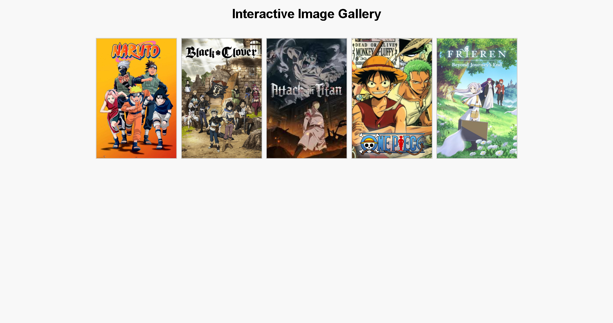

# Ex.08 Design of Interactive Image Gallery
## Date: 24-04-2025

## AIM:
To design a web application for an inteactive image gallery with minimum five images.

## DESIGN STEPS:

### Step 1:
Clone the github repository and create Django admin interface.

### Step 2:
Change settings.py file to allow request from all hosts.

### Step 3:
Use CSS for positioning and styling.

### Step 4:
Write JavaScript program for implementing interactivity.

### Step 5:
Validate the HTML and CSS code.

### Step 6:
Publish the website in the given URL.

## PROGRAM :
```
<!DOCTYPE html>
<html lang="en">
<head>
  <meta charset="UTF-8" />
  <meta name="viewport" content="width=device-width, initial-scale=1.0"/>
  <title>Interactive Image Gallery</title>
  <link rel="stylesheet" href="style.css" />
</head>
<body>
  <h1>Interactive Image Gallery</h1>
  <div class="gallery">
    
    
    
    
    
  </div>

  <div id="lightbox" class="lightbox">
    <span class="close">&times;</span>
    
  </div>

  <script src="script.js"></script>
</body>
</html>

body {
    font-family: Arial, sans-serif;
    text-align: center;
    background-color: #f8f8f8;
  }
  
  h1 {
    margin-top: 20px;
  }
  
  .gallery {
    display: flex;
    flex-wrap: wrap;
    justify-content: center;
    gap: 10px;
    padding: 20px;
  }
  
  .gallery img {
    width: 200px;
    height: auto;
    border: 2px solid #ccc;
    cursor: pointer;
    transition: transform 0.2s;
  }
  
  .gallery img:hover {
    transform: scale(1.05);
    border-color: #555;
  }
  
  .lightbox {
    display: none;
    position: fixed;
    z-index: 999;
    padding-top: 60px;
    left: 0;
    top: 0;
    width: 100%;
    height: 100%;
    background-color: rgba(0,0,0,0.9);
  }
  
  .lightbox-content {
    margin: auto;
    display: block;
    max-width: 80%;
    max-height: 80%;
  }
  
  .close {
    position: absolute;
    top: 30px;
    right: 35px;
    color: white;
    font-size: 40px;
    font-weight: bold;
    cursor: pointer;
  }
  
```
## OUTPUT:

## RESULT:
The program for designing an interactive image gallery using HTML, CSS and JavaScript is executed successfully.
